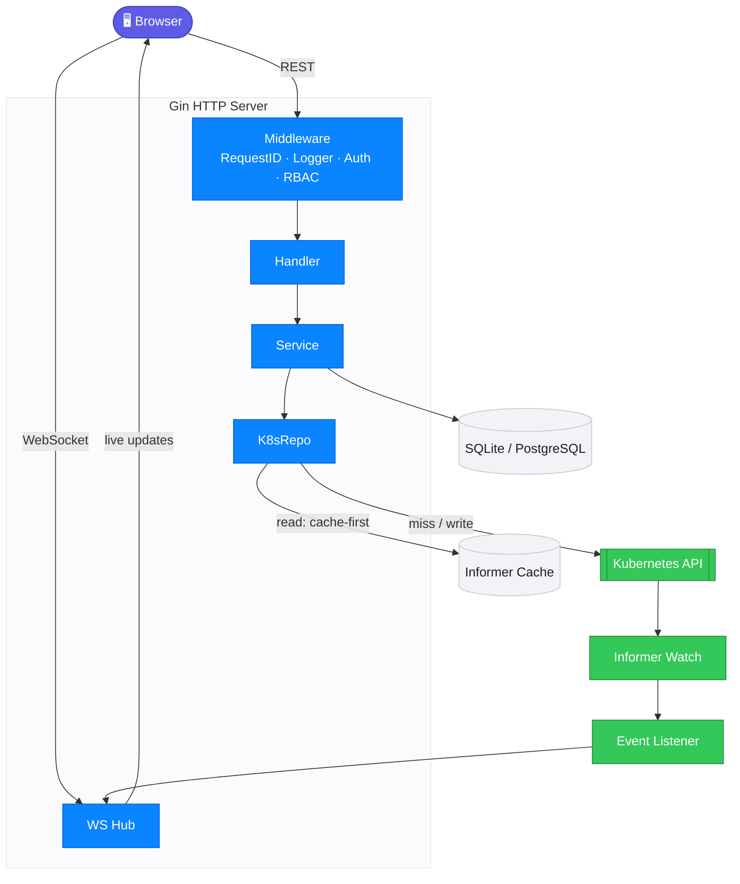

<div align="center">


# KubeVision

A modern, real-time Kubernetes dashboard

**Kube + Vision — See your clusters clearly, act on them instantly.**

[](https://go.dev) [](https://react.dev) [](https://typescriptlang.org) [](LICENSE)

**English** &nbsp;&nbsp;|&nbsp;&nbsp; [中文](./README_CN.md)

<br>

<!-- TODO: Replace with actual animated GIF showing a 15-20s workflow -->
<!--  -->

<!-- TODO: Replace with actual screenshot -->

</div>

<br>

## Why KubeVision?

<table>
<tr>
<td width="33%" align="center">

**Real-time Architecture**

Informer Watch → WebSocket Push.

Sub-second updates, zero polling.

</td>
<td width="33%" align="center">

**Fully Extensible**

1 line of Go + 1 config block per resource.

CRDs auto-discovered at runtime.

</td>
<td width="33%" align="center">

**Production Ready**

Multi-cluster, RBAC, 2FA, audit logging.

Built for teams, not just demos.

</td>
</tr>
</table>

<br>

## Screenshots

<table>
<tr>
<td width="50%" align="center">
<strong>Pod Terminal</strong><br><br>

</td>
<td width="50%" align="center">
<strong>Resource Topology</strong><br><br>

</td>
</tr>
<tr>
<td width="50%" align="center">
<strong>Resource YAML</strong><br><br>

</td>
<td width="50%" align="center">
<strong>Global Search</strong><br><br>

</td>
</tr>
<tr>
<td width="50%" align="center">
<strong>Terminal Audit</strong><br><br>

</td>
<td width="50%" align="center">
<strong>Dark Mode</strong><br><br>

</td>
</tr>
</table>

<br>

## Features

| Observability | Operations | Platform & Security |
|---|---|---|
| ⚡ **Real-time sync** — Informer → WebSocket | 🚀 **Deployment ops** — scale · restart · rollback | 🌐 **Multi-cluster** — one dashboard |
| 💻 **Pod terminal & logs** — recorded & replayable | 👀 **Dry-run diff** — preview before apply | 🛡️ **RBAC** — 5 roles + custom |
| 🗺️ **Resource topology** — ownership graph | 🔀 **Cross-cluster diff** — spot drift | 🔑 **2FA (TOTP)** — QR + recovery codes |
| 🔍 **Global search** — `Cmd+K` fuzzy | 🧩 **Templates** — one-click deploy | 📝 **Audit logging** — async + retention |
| 🤖 **AI assistant** — chat, inspect, mutate | ⚡ **Batch ops** — multi-select delete/restart | 🔔 **Webhooks** — Slack · Discord · custom |
| ⌨️ **kubectl hints** — auto-generated | 📦 **26+ resources** — cached + on-demand + CRD | 🌍 **i18n** · 🌙 **Dark mode** |

<br>

## Quick Start

### Helm (recommended)

```bash
helm install kubevision deploy/helm/kubevision
```

### Docker

```bash
docker build -f deploy/Dockerfile -t kubevision:latest .
docker run -p 8080:8080 kubevision:latest
```

> Open http://localhost:8080
>
> Default login: `admin` / `admin123`

### Development

```bash
git clone https://github.com/gocronx/kubevision.git
cd kubevision

# Backend — :8080
go mod tidy && make dev

# Frontend — :5173, proxies /api → :8080
cd web && pnpm install && pnpm dev
```

<br>

## AI Assistant

KubeVision ships an OpenAI-compatible AI assistant that can inspect and — only
with explicit user approval — mutate cluster resources through a fixed, RBAC-checked
tool set (get/list resources, pod logs, cluster overview, Prometheus queries, and
create/update/patch/delete with confirmation).

- **In the dashboard:** enable it under **Settings → AI Assistant** (admin only),
  then use the floating chat button. Works with OpenAI, OpenRouter, DeepSeek, Qwen,
  and any OpenAI-compatible endpoint.
- **In the terminal:** `kubevision ai` (see CLI below).

## CLI

The `kubevision` binary doubles as an admin CLI. With no command (or `serve`) it
starts the HTTP server; otherwise it runs an administrative command against the
configured database.

```bash
# Account management (reads the same DB/config as the server)
kubevision reset-password --username admin
kubevision reset-2fa --username admin
kubevision create-user --username dev --role editor --email dev@example.com
kubevision list-users
kubevision set-role --username dev --role admin
kubevision deactivate-user --username dev
kubevision activate-user --username dev
kubevision delete-user --username dev          # prompts to confirm; --force to skip

# Terminal AI assistant (chat with your cluster from the shell)
export API_KEY=... API_BASE_URL=https://api.openai.com/v1 MODEL_ID=gpt-4o-mini
kubevision ai "why is the web pod crashing in default?"   # one-shot
kubevision ai                                              # interactive REPL
```

Passwords are read with hidden input on a terminal and from stdin when piped.
Role changes and deactivation invalidate existing sessions, and the last active
super-admin cannot be demoted, deactivated, or deleted.

## Architecture

<div align="center">
  
  <p align="center"><em>Component overview</em></p>
</div>

### Data flow



> **Read** — Informer cache first, fall back to the API server.
> **Write / events** — API server → Informer watch → event listener → WS Hub → browser.

<br>

## Built With

1. [Gin](https://github.com/gin-gonic/gin) — HTTP framework
2. [client-go](https://github.com/kubernetes/client-go) — Kubernetes API client & Informer
3. [GORM](https://gorm.io) — ORM (SQLite + PostgreSQL)
4. [shadcn/ui](https://ui.shadcn.com) — Component library built on [Radix UI](https://radix-ui.com)
5. [TanStack Query](https://tanstack.com/query) — Server state management & cache
6. [xterm.js](https://xtermjs.org) — Pod terminal emulator

<br>

## Configuration

```yaml
server:
  port: 8080

database:
  driver: sqlite           # sqlite | postgres
  dsn: kubevision.db

auth:
  jwt_secret: ""           # auto-generated if empty
  access_token_ttl: 15m
  refresh_token_ttl: 168h

kubernetes:
  kubeconfig: ""           # empty = in-cluster
  informer_resync: 30m
```

| Variable | Description |
|----------|-------------|
| `KUBEVISION_SERVER_PORT` | HTTP port (default: 8080) |
| `KUBEVISION_DB_DRIVER` | `sqlite` or `postgres` |
| `KUBEVISION_DB_DSN` | Database connection string |
| `KUBEVISION_JWT_SECRET` | JWT signing secret |
| `KUBECONFIG` | Path to kubeconfig file |

<br>

## Documentation

**[kubevision-docs](https://kubevision-docs.pages.dev/)** — Full documentation site with guides, API reference, and architecture deep-dives.

| | |
|---|---|
| [Getting Started](https://kubevision.github.io/docs/getting-started/installation) | Installation, quick start, configuration |
| [Architecture](https://kubevision.github.io/docs/architecture/overview) | System design, data flow, component interactions |
| [User Guide](https://kubevision.github.io/docs/user-guide/cluster-management) | Features walkthrough and usage guides |
| [API Reference](https://kubevision.github.io/docs/api/overview) | REST & WebSocket API documentation |
| [Comparison](https://kubevision.github.io/docs/comparison) | How KubeVision compares to alternatives |

<br>

## Contributing

Contributions are welcome! Please open an issue first to discuss what you would like to change.

<!-- ## Contributors -->
<!-- <a href="https://github.com/gocronx/kubevision/graphs/contributors">
  
</a> -->
