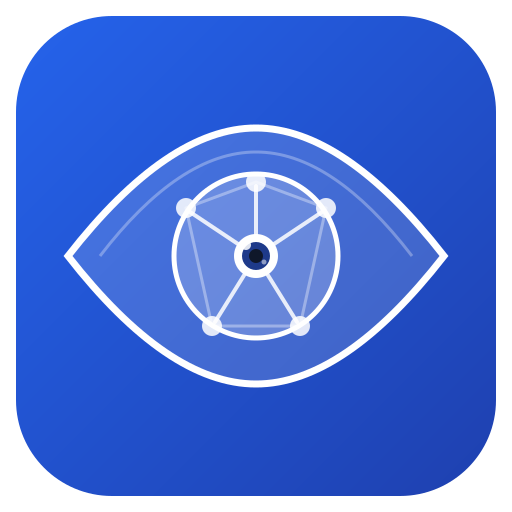
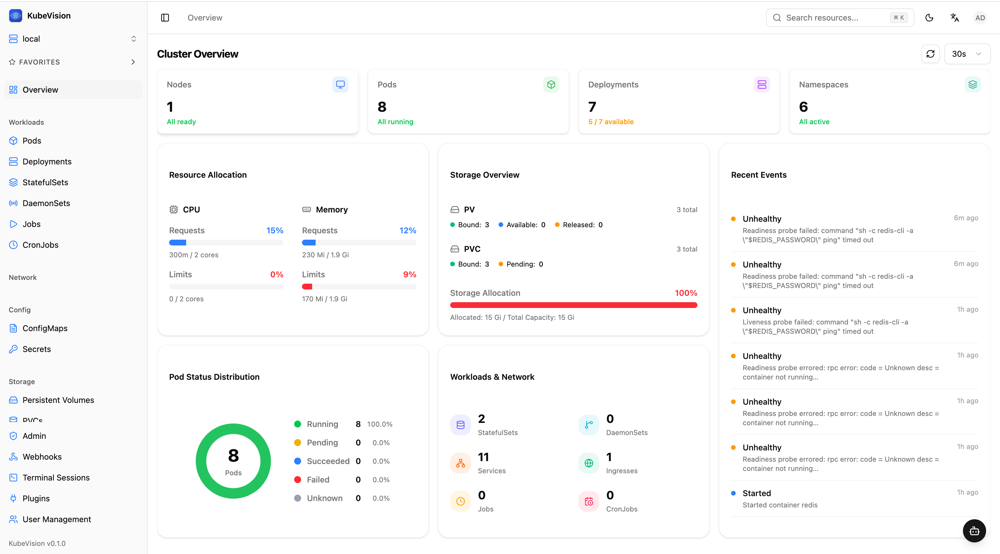
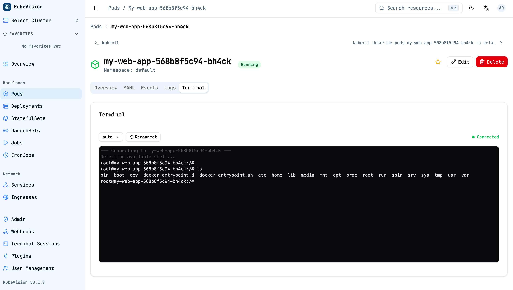
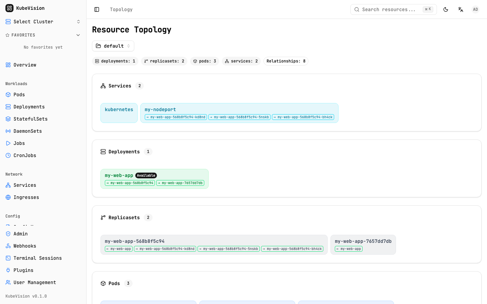
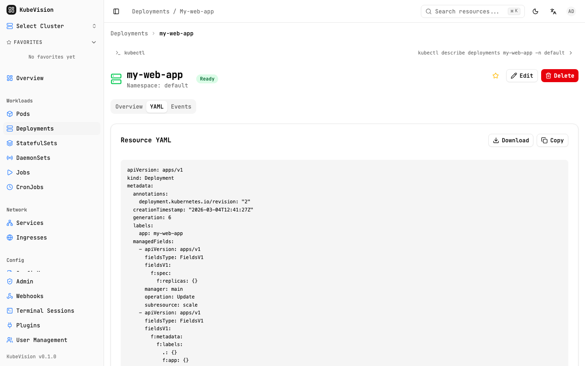
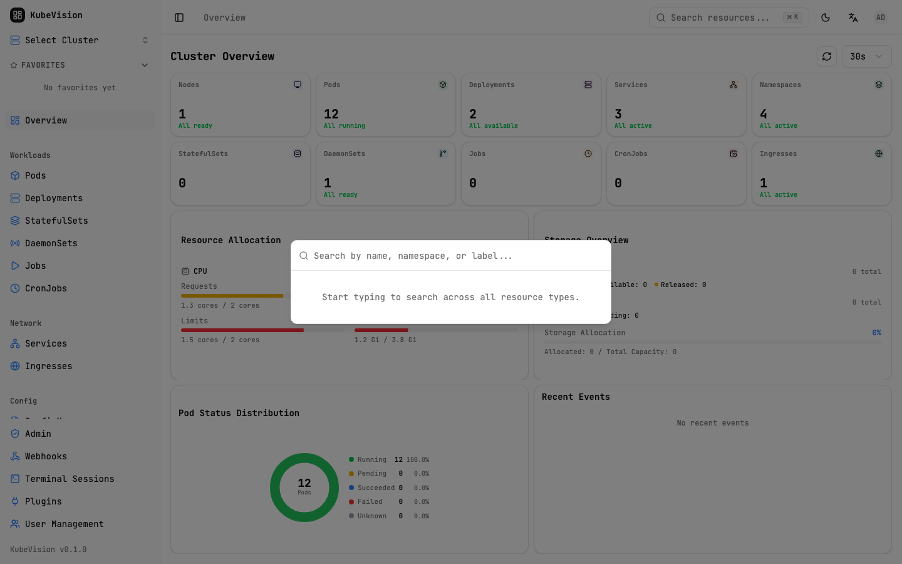
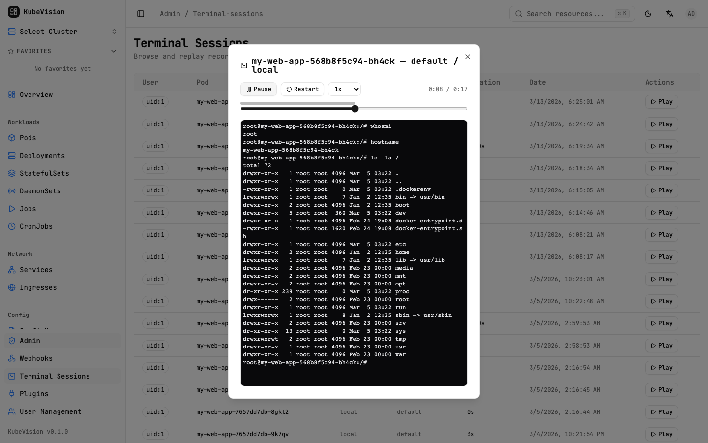
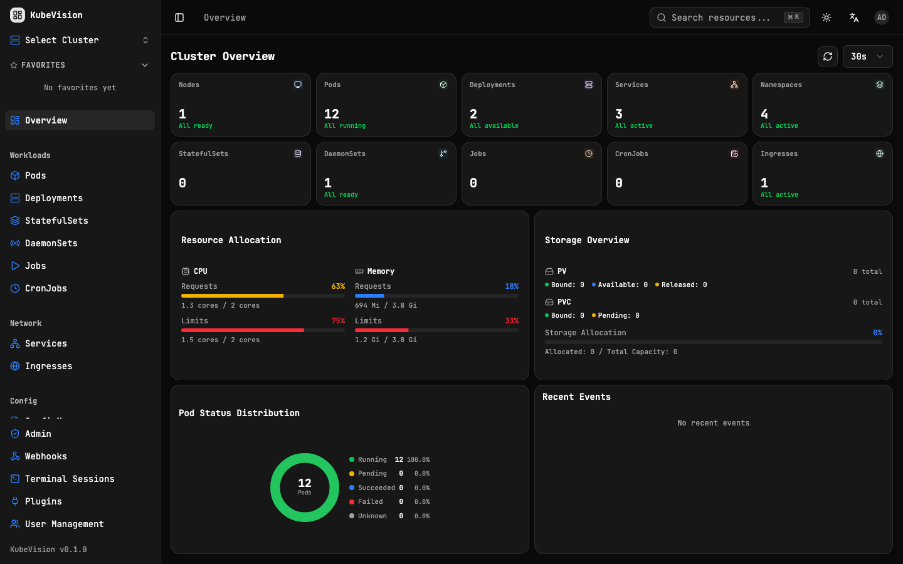
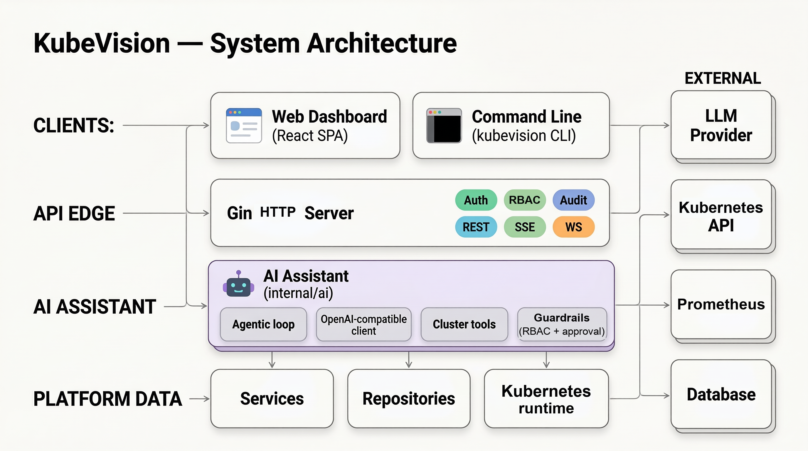
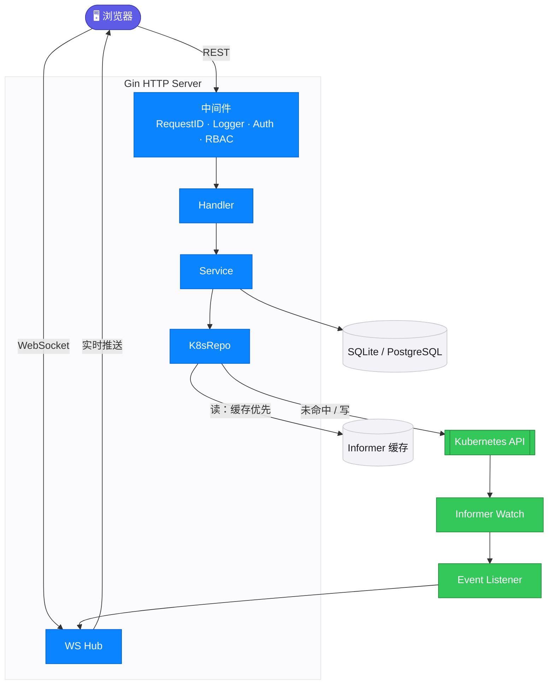

<div align="center">



# KubeVision

现代化的实时 Kubernetes 仪表盘

**Kube + Vision — 洞察集群全貌，即时响应变更。**

[](https://go.dev) [](https://react.dev) [](https://typescriptlang.org) [](LICENSE)

[English](./README.md) &nbsp;&nbsp;|&nbsp;&nbsp; **中文**

<br>

<!-- TODO: 替换为实际动图，展示 15-20 秒的操作流程 -->
<!--  -->

<!-- TODO: 替换为实际截图 -->

</div>

<br>

## 为什么选择 KubeVision？

<table>
<tr>
<td width="33%" align="center">

**实时架构**

Informer Watch → WebSocket 推送。

亚秒级更新，零轮询。

</td>
<td width="33%" align="center">

**高度可扩展**

每种资源只需 1 行 Go + 1 段配置。

CRD 运行时自动发现。

</td>
<td width="33%" align="center">

**生产就绪**

多集群、RBAC、2FA、审计日志。

为团队构建，而非仅供演示。

</td>
</tr>
</table>

<br>

## 截图

<table>
<tr>
<td width="50%" align="center">
<strong>Pod 终端</strong><br><br>

</td>
<td width="50%" align="center">
<strong>资源拓扑</strong><br><br>

</td>
</tr>
<tr>
<td width="50%" align="center">
<strong>资源 YAML</strong><br><br>

</td>
<td width="50%" align="center">
<strong>全局搜索</strong><br><br>

</td>
</tr>
<tr>
<td width="50%" align="center">
<strong>终端审计录频</strong><br><br>

</td>
<td width="50%" align="center">
<strong>暗色模式</strong><br><br>

</td>
</tr>
</table>

<br>

## 核心特性

| 观测与实时 | 操作 | 平台与安全 |
|---|---|---|
| ⚡ **实时同步** — Informer → WebSocket | 🚀 **工作负载操作** — 扩缩容 · 重启 · 回滚 | 🌐 **多集群** — 单面板管理 |
| 💻 **Pod 终端与日志** — 录制与回放 | 👀 **Dry-Run Diff** — 应用前预览 | 🛡️ **RBAC** — 5 级角色 + 自定义 |
| 🗺️ **资源拓扑图** — 可视化关系 | 🔀 **跨集群 Diff** — 发现漂移 | 🔑 **2FA (TOTP)** — QR 码 + 恢复码 |
| 🔍 **全局搜索** — `Cmd+K` 模糊 | 🧩 **资源模板** — 一键部署 | 📝 **审计日志** — 异步 + 保留 |
| 🤖 **AI 助手** — 对话查看与变更 | ⚡ **批量操作** — 多选删除/重启 | 🔔 **Webhook** — Slack · Discord · 自定义 |
| ⌨️ **kubectl 提示** — 自动生成 | 📦 **26+ 资源** — 缓存 + 按需 + CRD | 🌍 **国际化** · 🌙 **暗色模式** |

<br>

## 快速开始

### Helm（推荐）

```bash
helm install kubevision deploy/helm/kubevision
```

### Docker

```bash
docker build -f deploy/Dockerfile -t kubevision:latest .
docker run -p 8080:8080 kubevision:latest
```

> 打开 http://localhost:8080
>
> 默认账号：`admin` / `admin123`

### 本地开发

```bash
git clone https://github.com/gocronx/kubevision.git
cd kubevision

# 后端 — :8080
go mod tidy && make dev

# 前端 — :5173，/api 自动代理到 :8080
cd web && pnpm install && pnpm dev
```

<br>

## AI 助手

KubeVision 内置一个兼容 OpenAI 接口的 AI 助手，可查看资源，并在**用户明确确认后**
通过一组受 RBAC 校验的固定工具变更资源（查询资源、Pod 日志、集群概览、Prometheus
查询，以及需确认的 create/update/patch/delete）。

- **在面板中：** 进入 **设置 → AI 助手**（仅管理员）配置后，点击右下角浮动按钮即可使用。
  兼容 OpenAI、OpenRouter、DeepSeek、通义千问等任意 OpenAI 兼容服务。
- **在终端中：** `kubevision ai`（见下方 CLI）。

## 命令行工具

`kubevision` 二进制同时是管理 CLI：无子命令（或 `serve`）时启动 HTTP 服务，否则对配置
的数据库执行管理命令。

```bash
# 账号管理（与服务端共用同一数据库/配置）
kubevision reset-password --username admin
kubevision reset-2fa --username admin
kubevision create-user --username dev --role editor --email dev@example.com
kubevision list-users
kubevision set-role --username dev --role admin
kubevision deactivate-user --username dev
kubevision activate-user --username dev
kubevision delete-user --username dev          # 需输入用户名确认；--force 跳过

# 终端 AI 助手（在 shell 里和集群对话）
export API_KEY=... API_BASE_URL=https://api.openai.com/v1 MODEL_ID=gpt-4o-mini
kubevision ai "default 里的 web pod 为什么在重启？"   # 一次性
kubevision ai                                          # 交互式
```

终端下密码隐藏输入，管道输入时从 stdin 读取。改角色与停用会使现有会话失效；最后一个
活跃的 super-admin 不能被降级、停用或删除。

## 架构

<div align="center">
  
  <p align="center"><em>组件总览</em></p>
</div>

### 数据流



> **读链路** — Informer 缓存优先，未命中降级到 API Server。
> **写 / 事件** — API Server → Informer Watch → Event Listener → WS Hub → 浏览器。

<br>

## 核心依赖

1. [Gin](https://github.com/gin-gonic/gin) — HTTP 框架
2. [client-go](https://github.com/kubernetes/client-go) — Kubernetes API 客户端 & Informer
3. [GORM](https://gorm.io) — ORM（SQLite + PostgreSQL）
4. [shadcn/ui](https://ui.shadcn.com) — 基于 [Radix UI](https://radix-ui.com) 的组件库
5. [TanStack Query](https://tanstack.com/query) — 服务端状态管理 & 缓存
6. [xterm.js](https://xtermjs.org) — Pod 终端模拟器

<br>

## 配置

```yaml
server:
  port: 8080

database:
  driver: sqlite           # sqlite | postgres
  dsn: kubevision.db

auth:
  jwt_secret: ""           # 留空自动生成
  access_token_ttl: 15m
  refresh_token_ttl: 168h

kubernetes:
  kubeconfig: ""           # 留空使用 in-cluster
  informer_resync: 30m
```

| 变量 | 说明 |
|------|------|
| `KUBEVISION_SERVER_PORT` | HTTP 端口（默认 8080） |
| `KUBEVISION_DB_DRIVER` | `sqlite` 或 `postgres` |
| `KUBEVISION_DB_DSN` | 数据库连接字符串 |
| `KUBEVISION_JWT_SECRET` | JWT 签名密钥 |
| `KUBECONFIG` | kubeconfig 文件路径 |

<br>

## 文档

**[kubevision-docs](https://kubevision-docs.pages.dev/)** — 完整文档站，包含使用指南、API 参考和架构详解。

| | |
|---|---|
| [快速开始](https://kubevision.github.io/docs/getting-started/installation) | 安装、快速上手、配置说明 |
| [架构设计](https://kubevision.github.io/docs/architecture/overview) | 系统设计、数据流、组件交互 |
| [使用指南](https://kubevision.github.io/docs/user-guide/cluster-management) | 功能详解与操作指引 |
| [API 参考](https://kubevision.github.io/docs/api/overview) | REST & WebSocket API 文档 |
| [方案对比](https://kubevision.github.io/docs/comparison) | KubeVision 与其他方案的对比 |

<br>

## 参与贡献

欢迎贡献代码！请先提 Issue 讨论你想做的改动。

<!-- ## 贡献者 -->
<!-- <a href="https://github.com/gocronx/kubevision/graphs/contributors">
  
</a> -->
